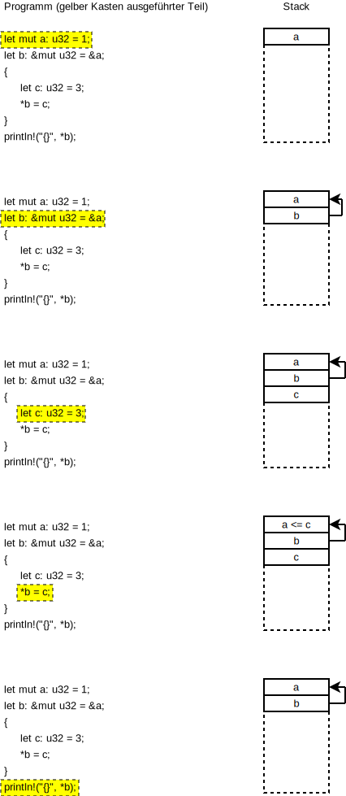

# Lifetime

## Kurz Auffrischung: Speichermodel

* Ein kurzer Ausflug in die Arbeitsweise des Stacks
* Jeder Variabledeklaration, Funktionsaufruf, etc. belegt normalerweise Speicher auf dem Stack (Optimierung ausgenommen)
* Werden Variablen in einem Scope erzeugt, wird der Stack bis zum Eintritt in dem Scope danach bereinigt
* Der Heap ist ein gesonderter Speicher, von dem Speicherbereiche dynamisch angefordert und freigegeben werden. Eine feste Ordnung wie beim Stack hat dieser nicht



## Das Ausleihproblem

* Durch das Ownership/Borrow-Konzept stellt sie die Frage, wie lange Speicherbereiche genutzt werden können
* Gibt es keinen Besitzer mehr und ist der Bereich nicht ausgeliehen, kann der Bereich freigegeben werden
* Rust nutzt keine Garbage Collection und braucht das Wissen über Speichernutzung 

```rust,compile_fail,should_panic
# fn main() {
    let mut a;
    {
        let b = 1;
        a = &b;
    } // b existiert nur im Scope und wird beim Verlassen freigegeben
    println!("a = {}", *a);
# }
```

* Der C-Kompiler würde dies Problem zwar anmerken, das Programm idR. aber übersetzen
* Die Ausführung erzeugt einen Fehler

```c
#include <stdio.h>

static int zero = 0; 

int* func() { 
    int b = 1;
    return &b;
}

int main(int argc, char* argv[]) {
    int *a = &zero;
    a = func();
    printf("%i\n", *a);
}
```

## Statische Laufzeit

* Kurzfristige Lösung für viele Probleme mit der Lebenszeit von Objekten
* Kann aber mitunter andere Probleme versachen, da hier ebenfalls wieder mit Referenzen gearbeitet werden muss, wenn die Speicherbereiche eine variable Größe haben sollen

```rust
fn main() {
    let mut a;
    {
        static b: i32 = 1; // b ist nun statisch deklariert und überlebt den Scope
        a = &b;
    }
    println!("a = {}", *a);
}
```

## Referenzzähler

* Am besten Vergleichbar mit dem `shared_ptr` in C++
* bei jedem `clone` wird die Referenz erhöht
* verlässt die Referenz ihren Scope wird die Referenz heruntergezählt
* Ist die Referenz 0 wird der Bereich freigegeben

```rust
use std::rc::Rc;

static ONE: i32 = 1;

fn main() {
    let mut a = Rc::new(0);
    println!("address of a={:p}", a);

    {
        let b = Rc::new(ONE);
        println!("address of b={:p}, address of one={:p}", b, &ONE);
        a = b.clone();
    }

    println!("address of a={:p} after changing", a);
    println!("content of a = {}", *a);
}
```

* `Rc` ist nicht nicht thread-safe, stattdessen sollte `Arc` verwendet werden

