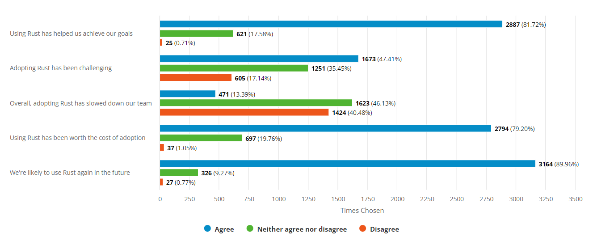

## Was ist Rust eigentlich?

* Programmiersprache für [verschiedene Plattformen](https://doc.rust-lang.org/nightly/rustc/platform-support.html) wie x86, ARM, Webassembly für den Browser
* Sprache wird kompiliert und nicht interpretiert
* Kompiler heißt `rustc`, der auf LLVM basiert, GCC Frontend auch möglich
* Paketmanager heißt `cargo`
* Bibliotheken/Anwendungen sind in `crates` organisiert
* Weiterentwicklung wird von der [Rust Foundation](https://foundation.rust-lang.org/) organsiert, Gründer waren neben [Mozilla, u.a. Amazon, Google & Huawei](https://foundation.rust-lang.org/members/)

## Ein kurze Geschichte

Es war einmal ein Browserhersteller namens Mozilla, der hatte viel C/C++ Code.

Mehrkernprozessoren wurden immer verbreiteter und paralelle Code-Ausführung wurde immer wichtiger.

Parallele Code-Ausführung für C/C++ ist aber aufwendig, kompliziert und es gilt vieles zu bedenken.

Tools gibt es zur genüge für Code-Analyse, aber viele Dinge können davon auch nicht abgefangen werden.

Menschen produzieren unvermeidlich Programmierfehler. Programme stürzen ab und verursachen Sicherheitslücken.

Um das zuvermeiden gab es keine sinnvolle Programmiersprache.

## Was macht die Sprache aus?

* systemnah
* bietet ein Ausführungsgeschwindigkeiten und Optimierungen wie C/C++
* in Zukunft auch im [Linux Kernel](https://github.com/Rust-for-Linux) vertreten
* durch verschiedene Sprachkonstrukte wird sicherer Code produziert
* Nutzt viele Konzepte aus bereits existierenden Sprachen
  * Starke Typisierung 
  * Abstraction by Zero Cost (`Templates`, `Generics`)
    * Einführung von komplexen Abstraktionen
    * Kombinationen von verschiedenen abhängigen Implementierungen
    * Ausführung von nur benötigten Bestandteilen der Abstraktionen
  * Funktionale Ansätze
    * Jede Methode ist eine Funktion
    * Map/Reduce
  * Keine Objektorientiertung, stattdessen Traits und Implementierungen
    * Defintion eines gemeinsamen Verhaltens
    * Traits werden durch Implementierungen für Typen umgesetzt
  * Pointer und Referenzen
  * Explizite Deklaration von unsicheren Bereichen (`unsafe`) für die Kompatiblität zu C-Implementierungen
* Implizite Speicherverwaltung
  * Keine Garbage Colleciton wie `golang`, `Java` oder `C#`
  * Viele Operationen finden nur auf dem Stack statt
  * Variablen sind bei der Deklaration standardmäßig nicht veränderlich
* Befragung für 2021

## Sicherheit durch Ausdruck

* Ownership-Konzept
    * Instanziierte Speicherobjekte haben zu jeder Zeit immer einen Besitzer
    * Variablen wechseln den Besitzer oder müssen an dessen ausgeliehen (Borrow) werden
    * Borrow-Checker
      * Prüft ob der Besitz geklärt ist
      * Prüft ob eine Variable verändert werden darf, d.h wird an verschiedene Stellen zeitgleich darauf zugegeriffen und gar verändert, führt dies zu einem Kompilierfehler
      * dies bricht an vielen Stellen mit den gewohnten Konzepten von anderen Programmiersprachen (Singleton)
* Lifetime Checker
    * Analyse des Scopes, der enthaltenen Variablen und deren Referenzen
    * Die Lebenszeit von Speicherobjekten muss zu jeder Zeit bekannt sein
    * Die Lebenszeit eines Speicherobjekts endet in der Regel mit dem Verlassen des Scopes

## Installation

* Vollständige Installation übr [rustup.rs](https://rustup.rs/)
* Alternativ kann auch der [Rust Playground](https://play.rust-lang.org/) verwendet werden

# Lust auf mehr Rust

* [Rust by Example](https://doc.rust-lang.org/rust-by-example/index.html)
* [Rust Book](https://doc.rust-lang.org/book/)
* [Dokumentation der Standardbibliothek](https://doc.rust-lang.org/std/index.html)
* [FAQ](https://prev.rust-lang.org/de-DE/faq.html)
* [Rust Pakete bei crates.io](https://crates.io)
